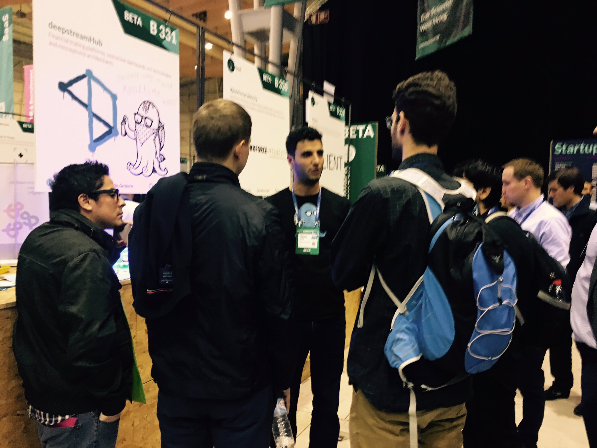
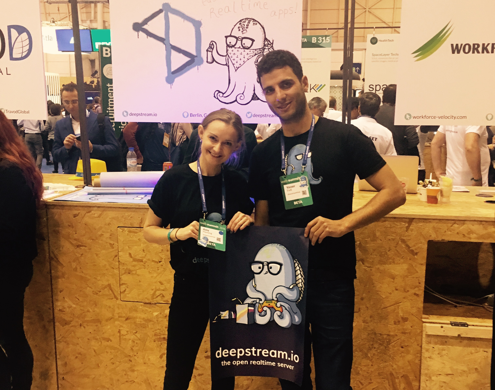

One rainy day we ventured across land, air and sea to the Portuguese capital of Lisbon, for the monstrous ‘techsperience’ they call Web Summit - where we basked in the sunshine and rubbed shoulders with the likes of Microsoft, Facebook and the odd escapee from [Hollywood](https://websummit.net/speakers).

The three day event was bustling with entrepreneurs and industry folk all scrambling to create impactful relationships and discover emerging trends. At 5ft tall at times my oxygen was sacrificed to make the journey from one pavilion to the next, but I’ve made it and returned to Berlin, not only a survivor but armed with motivation and ideas for how we should tackle the event again next year.

While working in SMEs, a question I repeatedly ask myself is whether sponsoring big international tech conferences is really worth the time and expense, especially when spearheading an open source project or a new startup.

The answer I usually settle on, and will again today is: yes.

If there’s one thing that conferences are all about it’s human interaction. Even in the age of social networks and constant what’s-apping there’s no better way to establish rapport and make an impression than face to face meetings, be it with clients, investors or potentials.

But just attending a conference might not be enough. Getting the best bang for your for buck can require speaking, running a panel, hosting a small stand, offering to partner for the after party or - if you’ve just stumbled upon a pot of gold: sponsorship.

Not only does this get you complimentary tickets, it can also increase your visibility fourfold at less or similar cost than by sending more members from the team. With that being said, regardless of the manner in which you attend; executed correctly these conferences have proven to be an invaluable resource - as long as you remain thoughtful of expenditure and cautious of unintentionally distracting core team members from other priorities.

If you’ve got the stamina:  few hundred words down I’ve included some quick tips (that don’t require much effort) for maximizing value when attending as a delegate for tech shows.

## So how about WebSummit?

Not only since outgrowing the confines of Dublin, Web Summit became a rather noisy conference - jampacked with startups of all stages, distributed across topics such as Web & Mobile Apps, SaaS, Advertisement, FinTech, Bigdata, IoT, Recruitment, AI and so on.
Large and aspirational brands are just as present - by hosting / speaking / sponsoring or broadcasting.

A conference of this magnitude sources opportunity for efficient business and for like minded people to gather; from startup founders to enterprise CTOs, from veteran developers to wide-eyed, hungry entrepreneurs.

Filtering the signal from this noise of opportunity requires some organisation and pre-planning. Whether it’s booking meetings upfront, keeping a tight agenda whilst being herded through the cattle-gates of investor-world, heavily guarded by dedicated Web Summit Investor Protection Security Officers (WIPSOs) armed with their ever-present clipboards or liaising via the event app, where you were enabled to search and pester other attendees / businesses and participating investors whenever, wherever!

In a condensed amount of time, Web Summit provided an overwhelming number of interesting people to meet - most of which were there motivated by individual missions to share and seek knowledge, guidance, inspiration, lucrative deals, user adoption or employment opportunities.

## Conference hacking - quick tips
- Get business cards and low cost giveaways to hand out to tech enthusiasts and potential clients you meet. People like free stuff.
- Aim for accommodation as close to the venue as possible. It’s a great feeling knowing your hotel bed is not too far away.
- Keep a phone charger in your hat, tucked in one sock or tied to your belt.

## Plan a bit
Create some buzz leading up to the event by informing your network through social channels and meeting invitations.
Research who else you’d like to meet, such as investors or media - if possible drop them a short message in advance to introduce yourself, your offering and to request a meeting.
Know your pitch - practice key words and positive associations to incorporate into your messaging.

## But don’t plan too much
Prior to event day sign up to the talks, dinners or evening event invitations that arrive in your inbox if they are of interest. It’s good to have a rough plan to rely on - just don’t be too strict with your activity commitments - many alternative opportunities may arise, and you should do what seems the most fun :)

## Be remarkable
Be tough - you’re likely to be swamped with inbound interest. Feel free to forcefully move on to another contact if necessary
And sometimes… play down your availability. Yes, of course you’re at a conference so that people can talk to you. But sometimes adding a pinch of exclusivity to your meeting calendar’s access is just what it takes.

## Know your metrics
A conference’s ROI is incredibly hard to measure, but measuring the pleasure of meeting people who work or engage with your product is just as hard.
Something you can do though, is establish how many meetings you need and what you will expect as outcome - Competitor research? Networking? Deals? - Decide how to make each meeting count. Keep coherent notes and evaluate your take-aways after it’s over.

## Follow up - but be cool
There's never a bad reason to cultivate and maintain a solid network of professionals from your industry and following up is imperative to help sculpt that lasting impression. But sleep first and then think about your approach. You should take time to recover from all the talking (drinking) and long hours without rest away from home.

In that spirit, here’s a shout to the memorable people, presentations and products from Web Summit 2016:

- Jacki Vause [@Vausey](https://twitter.com/Vausey) - Founder of [@DimosoAgency](https://twitter.com/DimosoAgency) hosted a lovely party with [@eyefitu](https://twitter.com/eyefitu) - an innovative customizable shopping app.
- CTO [@GONZALORUIZCA](https://twitter.com/GONZALORUIZCA) from [@MSAccel](https://twitter.com/MSAccel) - Microsoft Accelerator is a global initiative built to help entrepreneurs around the world on their journey to build great companies.
- [@collectAI](https://twitter.com/collectAI) - The Hamburg based fintech company provides services for automated debt collection using big data and machine learning technology.
- Based in Ireland [@YoStartups](https://twitter.com/YoStartups) is on a mission to reduce the 90 % failure rate of startups by providing them early stage branding & access to the best minds from around the world.
- [@cleverbridge](https://twitter.com/cleverbridge) - Headquartered in Cologne there product is a flexible, cloud-based billing and monetization solution for subscription businesses.
- [@kusanagi_io](https://twitter.com/kusanagi_io) - is a stealth startup based in Madrid, building next-generation web application architecture, driven by automated intelligence.
- [@domraider](https://twitter.com/domraider) - This French company specializes in the recovery of expired domains, in order to benefit from SEO assets by leveraging its existing netlinking and its historical legitimacy
- Product Marketer Steph Pilon [@PeeLawn](https://twitter.com/peelawn) from [@adjustcom](https://twitter.com/adjustcom) a mobile user attribution and advanced app analytics platform.

You can also check out what other attendees said [here](https://websummit.net/reviews-attendee)