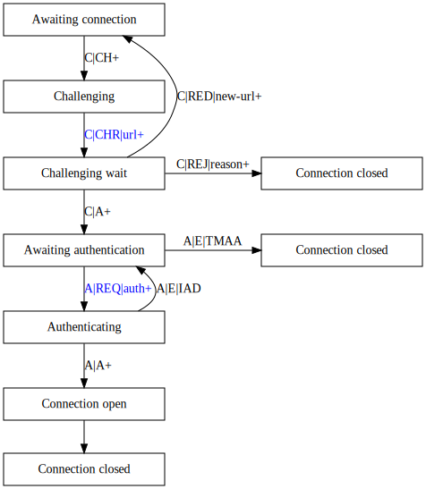

deepstream is an open platform that uses a minimal, text-based protocol to
communicate between server and client and below is an example of what this looks
like.

```gherkin
# Connection established
# Clients sends authentication request
> A|REQ|{"username":"XXX","password":"YYY"}+

# Server acknowledges authentication
< A|A+

# Client subscribes to some event
> E|S|someEvent+

# Server acknowledges the subscription
< E|A|S|someEvent+

# Server sends a message for this event
# (the S in SmoreDetails indicates type:String)
< E|EVT|someEvent|Smore details+
```

deepstream communicates via websockets. Combining our tight integration with
[µWS](https://github.com/uWebSockets/uWebSockets), this means that pretty much
everything from basic Arduinos to enterprise Java servers can communicate with
deepstream over the websocket protocol.

If you would like to write a client for your language of choice, have a look if
there exists [already an issue for
it](https://github.com/deepstreamIO/deepstream.io/labels/new-client) and get in
touch! We would be more than happy to help.

## Where to start?
Here's how to tackle writing a deepstream client:
- have a look at the [message structure
  overview](/info/protocol/message-structure-overview/),
- establish a websocket connection to a deepstream server,
- send an [auth message and parse the response](/info/specs/connectivity/),
- start implementing [events](/info/specs/events/) as they are the simplest
  feature, and
- add records, RPCs, and so on.

Below are some more resources and considerations that will prove useful in writing new clients.

## Message Specifications

Visit [here](/info/protocol/all-messages/) for a reference of all the different
messages in deepstream communication. If you are unsure about the meaning of a
received message, if you want to find out if it has an associated ack message,
or if you want a quick introduction into the low-level protocol, then this is
the perfect place to bookmark.

## Feature Testing

Making sure your client works in the exact way the server expects it to can be
quite challenging when running against a real server. Because of this, we at
deepstreamHub test all protocol features with [Cucumber](https://cucumber.io/);
with Cucumber, you specify the expected behavior in certain use cases of an
application with a number of scenarios in a high-level programming language. The
high-level language is not specified and instead, Cucumber translates fragments
(so-called _steps_) of the scenario description according to a provided set of
rules into code in a given target (programming) language. Since the scenarios
define input and expected output, the generated tests can be run fully automated
and continuously against the clients. By passing all tests, you can be more
confident that the client implements the deepstream protocol correctly.

In order to use Cucumber during development, you need to provide
- scenarios,
- step definitions, and
- when testing deepstream clients, you need a websocket server.

To guarantee that no errors are being ignored we strongly suggest adding a
[Cucumber hook](//github.com/cucumber/cucumber/wiki/Hooks) to run after each
use case (_feature_ in Cucumber lingo) which checks that no unexpected errors
were thrown.

### Example

The page [connectivity features](/info/specs/connectivity/) contains Cucumber
test scenarios, Node.js step definitions can be found
[here](//raw.githubusercontent.com/deepstreamIO/deepstream.io-client-js/master/test-specs/steps/server/step-definition-server.js),
and a Node.js websocket server is
[here](https://raw.githubusercontent.com/deepstreamIO/deepstream.io-client-js/master/test-specs/steps/server/ws-server.js).


## Connection States

Next on is the [connection states](/docs/common/constants/#connection-states). A
connection starts off in an `AWAITING_AUTHENTICATION` mode in which you are
required to log in to be able to send and receive messages through the server.
Once you do the client should be in `AUTHENTICATING` state, and if the login is
successful, then the connection will end up in `OPEN` state meaning everything
worked fine.

Initially, a connection starts in the `AWAITING_CONNECTION` state with the client
waiting for the server to send a connection challenge moving the client into the
`CHALLENGING` state. Here, the client is expected to send a challenge response
containing the server URL and to transition into `CHALLENGING_WAIT` afterwards.
The server server can
- accept the response and put the client into `AWAIT_AUTH` state,
- reject the client, optionally providing a reason, or
- redirect the client to a different server.
In `AWAIT_AUTH` state, the client has to send a valid username and password
combination to the server before it can move into the `AUTHENTICATING` state.
The server can
- accept the credentials which finalizes the connection setup,
- reject the credentials and return the client to `AWAIT_AUTH` state, or
- drop the connection altogether after too many failed authentication attempts.

If the connection does drop, clients are expected to go into reconnecting mode
to allow them to try and reestablish the connection. In this state, the client
can either return to the `AWAITING_AUTHENTICATION` state or it will close the
connection to the server after a certain number of reconnection attempts.



## Message Buffering

Since clients are expected to have a very high throughput it's good practice to buffer messages within the program and then send it out once at the end of a CPU cycle.

For example, let us say I have a loop that generates lots of events:

```javascript
while( i < 10000 ) {
    deepstreamClient.event.emit( 'value', Math.random() );
    i++;
}
```

If I was to send the message through directly to the websocket for every iteration it would create an overhead having to interact with the socket directly so often. Instead, we can concatenate the messages within the client and then send them in one go. Because of the use of the message seperation character the server can then split the package up and process them in the same order.

```javascript
connection.prototype.send = function( message ) {
    bufferedSendMessage += message;
    if( !flushTimeout ) {
        flushTimeout = setTimeout( flushMessage );
    }
}
```

The same situation happens when you receive a message. If the traffic is slow you might only be getting one message per packet, but when traffic volumes pickup you will need to split the data received and process each message individually.

```javascript
connection.prototype.receive = function( message ) {
    var lastMessageSeperator, messages;

    lastMessageSeperator = receivedMessages.lastIndexOf( MESSAGE_SEPERATOR );
    messages = receivedMessages.substring( 0, lastMessageSeperator);
    processMessages( messages );
}
```

## Acks

Unfortunately timeouts can always occur when internet connections become so slow they might as well not work. Because of this deepstream has ack messages to let the client know the server has received the messages sent.

Ack timeouts are the clients responsibility to keep track of. When a message that can get an associated ack is sent out, you need to set a timer which can be removed once the server replies. If not the application will be notified which depending on the situation can allow you to try the same action again, or notify the user their desired behaviour might not have gone occurred successfully.

## Unsoliciated Messages

Messages received that are unexpected should throw an `UNSOLICITED_MESSAGE` error. If it occurs often it's usually a useful indication something might be leaking or not have unsubscribed properly.

{{#infobox "hint" "Edge Case"}}
- In the case of race conditions this could occur if the server sends a message to the client the exact same time it unsubscribed from the message. This can't be avoided, but should only happen very rarely.
{{/infobox}}

## Errors

The last major thing to keep in consideration are error scenarios. If you look
at the [event constants](/docs/common/constants/#Event) you'll notice that there
are quite a few different unhappy scenarios that may occur. Many of these are
expected behaviour, such as `MESSAGE_PERMISSION_ERROR` or
`TOO_MANY_AUTH_ATTEMPTS`. Others are errors returned by deepsteam in case the
message protocol was not correctly used, such as `INVALID_MESSAGE_DATA`,
`MESSAGE_PARSE_ERROR`, or `UNKNOWN_TOPIC` and some are to expose internal issues
such as `CACHE_RETRIEVAL_TIMEOUT` or `STORAGE_RETRIEVAL_TIMEOUT`.

It is important...
* not to let the application die when an error occurs. Thus, always recover from
  them as gracefully as possible.
* not to swallow errors. Errors occur because something went wrong so having an
  empty catch statement is only a stop gap solution. Instead you should always
  make sure to log the issues that occur.
* to prevent users from doing things they are not permitted to do. If a
  user has no permission to perform a certain action, then it is advisable not
  to perform the desired action. Otherwise it could result in inconsistencies on
  the server where the data was ignored and on the client where the changes
  either have to be reverted once the `MESSAGE_DENIED` error is received or
  remain out of sync otherwise.
