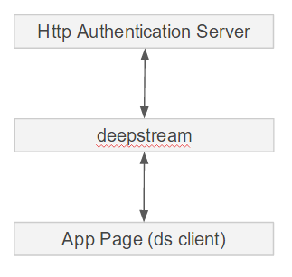
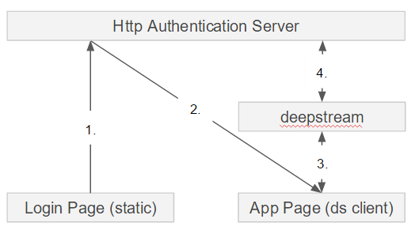
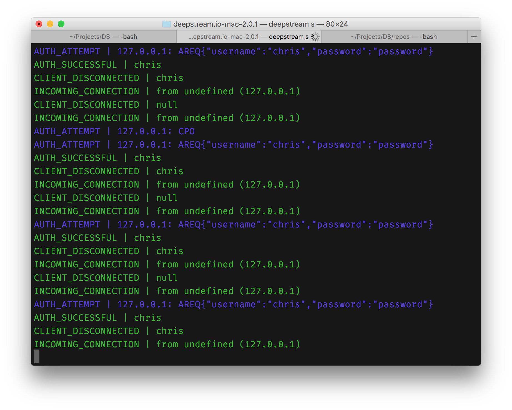

Authentication is vital to most apps and the way it is achieved has evolved substantially in recent years. One of the most popular of todays concepts is a standard called [JSON Web Token](https://jwt.io/) or JWT for short that let's you store encrypted information in verifiable tokens.

deepstream can use a number of strategies to autenticate incoming connections. For JWT we'll use deepstream's [HTTP-Webhook](/tutorials/core/auth-http-webhook/) - a configurable URL that deepstream will send both login and connection data to for verification.

## Should you use JWT with deepstream?
Maybe. Traditional tokens serve as primary keys to session data, meaning they help the backend retrieve data relative to a users session. A JWT on the other hand IS the actual session data - the cookie itself contains a payload and releaves the backend from having to constantly look session data up.

This is great for HTTP workflows where clients make many individual requests that are all associated with the same user. deepstream however uses a persistent connection that is only established once when the client connects (okay, and maybe occasionally again if the connection drops). All session data stays associated with that connection, rather than with the requests and subscriptions made through it. As a result, deepstream messages are significantly smaller and faster than their HTTP equivalents.

This however does mean that deepstream itself doesn't benefit much from using JWT. It doesn't hurt much either though and can still be helpful when deepstream is used in conjuntion with traditional HTTP endpoints.

## deepstream's Auth Webhook

Before you begin performing authentication with JWT, it's worth noting that deepstream allows you to register an HTTP endpoint URL to which a POST request is sent whenever a client or backend process attempts to log in.


The [HTTP Authentication](/tutorials/core/auth-http-webhook/) guide covers how to setup this workflow in your project.

## deepstream HTTP Auth with JWT
[JWT](https://jwt.io) allows us to transport claims securely from server to client and vice versa using an encoded JSON string. This token is persisted on the client and used to make authorized requests as long as the token is valid (not tampered and not expired).

Looking back at the flow described above, JWT needs to be put somewhere in the picture. For that, there are two choices:

## The simple, but less secure one



In this scenario the deepstream client sends the user's credential to deepstream which forwards it to a configured HTTP endpoint.

The endpoint creates the JWT and passes it back through deepstream to the client which stores it in localStorage

For subsequent requests the token is already in localStorage and will be sent by the client instead of asking the user for credentials.

### Why is this less secure?
Storing the token in localStorage or in a cookie using javascript leaves it readable to all scripts on the page. This leaves it open for cross site scripting attacks (XSS) that can hijack the session.

Likewise this approach requires the web application itself and all its assets to be publickly readable. Using the following approach however would allow you to redirect all unauthenticated requests to the webapp to a login page.

## The complicated, secure one
The recommended workflow looks as follows:



The steps shown here are

1. The user provides credentials in a static login page which are sent via HTTP POST request to the auth server.
2. If the provided credentials are valid, the server generates a JWT and responds with a 301 redirect to the web-app page that stores the token as a cookie
3. The deepstream client establishes a connection to the deepstream server and authenticates itself by calling `ds.login(null, callback)`. This sends the stored cookie containing the JWT to the deepstream server.
4. deepstream forwards the cookie to the authentication server and awaits its reply. The auth server also has the option to parse the cookie and provide the data it contains back to deepstream to use within [Valve Permissions](/tutorials/core/permission-conf-simple/). If the authentication server returns a positive response (e.g. HTTP code 200) the connection is authenticated.

So much for the theory - here's how this works in practise:

## Enabling HTTP Auth
By default, HTTP Authentication is disabled. It needs to be enabled via the [configuration file](/docs/server/configuration/) while setting up some configuration as well:

```yaml
type: http
options:
  endpointUrl: https://someurl.com/auth-user
  permittedStatusCodes: [ 200 ]
  requestTimeout: 2000
```

Remember, the ds client makes a request to ds server through your browser so there should be a way to forward this request to our own server. This is achieved using the `endpointUrl`. `permittedStatusCodes` allows you to specify a list of acceptable HTTP status codes while the `requestTimeout` option specifies how long the request should wait for a response before hanging up.

## deepstream Login
From what you know already, deepstream's `login` method is always called immediately after initialization:

```js
var client = deepstream('localhost:6020')
		  // Login method
		  .login( null, ( success, clientData ) => {

      })
	    .on( 'error', ( error ) => {
	        console.error(error);
	     });
```

The deepstream client only becomes functional once `login` is called. 

# !!! ------------- !!!

The method takes no credentials and can be known as anonymous authentication. There is more to the `login` method. An authentication object containing the `username` and `password` could be passed in:

```js
var usernameText = document.getElementById('username').value,
    passwordText = document.getElementById('password').value;
    
var client 
	= deepstream('0.0.0.0:6020')
		  .login({
		  // Credentials from text input
			username: usernameText,
			password: passwordText
			})
	      .on( 'error', ( error ) => {
	        console.error(error);
	      });
```

Your next login attempt will produce the following log:



## Auth Webhook
Based on our configuration, when the login method executes successfully, it is expected to call the `endpointUrl` specified in the `config.yml` file. This URL handler should be prepared to receive payload in the following manner:

```json
{
  "connectionData": {...},
  "authData": {
	  username: 'chris',
	  password: 'password'
  }
}
```

Using [Node](https://nodejs.org) with [Express](http://expressjs.com/) the route can be handled using the following approach:

```js
// . . .
var jwt = require('jsonwebtoken');

app.post('/validateLogin', function(req, res) {
  // Mock users
  var users = {
    wolfram: {
      username: 'wolfram',
      password: 'password'
    }
    chris: {
      username: 'chris',
      password: 'password'
    }
  }
  
  var user = users[req.body.authData.username];

  if (!user) {
      res.status(403).send('Invalid User')
    } else {
      // check if password and username matches
      if (user.username != req.body.authData.username || user.password != req.body.authData.password) {
        res.status(403).send('Invalid Password')
      } else {

        
        // if user is found and password is right
        // create a token
        var token = jwt.sign(user, 'abrakadabra');
        
        // return the information including token as JSON
        res.status(200).send({
          username: user.username,
          clientData: { 
            success: true,
            message: 'Have your token!', 
            token: token,
            username: user.username
          },
        });
      }   
    }
});

// . . .
```

The `jsonwebtoken` module is used to generate and sign a token using the auth payload which of course is verified first.

The client expects a result after the login and this result can be captured using the `client.login` second argument which is a callback:

```js
client.login({username: usernameText, password: passwordText}, function(success, data) {
    if(!success) {
      console.log('Error occured');
      return
    }
	// Data is the payload sent back from the the `/validateLogin` route which includes a token
    console.log(data);
  })
```

The callback's second parameter is the payload sent back from the webhook route which includes the JSON web token.

## Persisting Tokens for Re-use

JWTs are stateless which means that you cannot access them from a previous request. This is very good as it fits well in API driven applications and single page apps as well. The only challenge is that it makes no sense to always ask the user for their credentials per request so there should be a way to persist the token so it can be re-used across sessions over time as long as it is valid.

Web storage (localStorage and sessionStorage) and cookies are the most common solutions for persisting tokens. Cookies are [more secure]() because it is difficult to hijack its contents with injected scripts __if the `httpOnly` flag is set to `true`__.

Rather than calling deepstream's `client.login` directly when the form is submitted, it's better to use a different route to handle the form submission, generate the token and set the cookie:

```js
// . . .
var cookieParser = require('cookie-parser');
var jwt = require('jsonwebtoken');

//. . .
// Set cookie middleware
// so as to access cookie from res/req objects
app.use(cookieParser('ahahsecret', {path: '/', secure: true, httpOnly: true}));

app.post('/handleLogin', function(req, res, next) {
  
   var users = { /* . . .*/ }

  var user = users[req.body.username];

  if (!user) {
      res.status(403).send('Invalid User')
    } else {
      // check if password and username matches
      if (user.username != req.body.username || user.password != req.body.password) {
        res.status(403).send('Invalid Password')
      } else {

        
        // if user is found and password is right
        // create a token
        var token = jwt.sign(user, 'abrakadabra');

        
        // 1. Set token cookie
        // 2. Set httpOnly flag to true for
        // the cookie
        res.cookie('access_token', token, {httpOnly: true}).status(200).send('Token set');
      }   
    }
});

// . . .
```

The following is how the client does a usual HTTP POST request to this `handleLogin` route so as to generate the token and cookie:

```js
var usernameText = document.getElementById('username').value,
    passwordText = document.getElementById('password').value;
    
axios.post('/handleLogin', {username: usernameText, password: passwordText})
      .then((response) => {
        console.log(response);
       client.login({username: usernameText, password: passwordText}, handleLoginCallback)
      })
      .catch(function (error) {
        console.log(error);
      });
```

[Axios](https://github.com/mzabriskie/axios) is an HTTP library that allows you to handle requests/responses using promises. When the request is completed, a token cookie is set on the server and back to the client, a deepstream login is attempted.


To show that this token is protected with `httpOnly` flag and cannot be accessed via the client, run `document.cookies` in the console and observe that the `access_token` is not printed in as much as it exists.

## Accessing Cookie Token
The token is safely stored but useless if it does not perform its tasks. For every request that needs to gain access to the token, whether HTTP or via deepstream, the token is available.

For bare HTTP, you can access the cookies with:

```js
console.log(req.cookies);
```

...and for deepstream, you can access the cookies from `connectionData`:

```js
// . . .
app.post('/validateLogin', function(req, res) {

var access_token = res.body.connectionData.cookies.access_token

  if (!access_token) {
      res.status(403).send('No token found')
    } else {
      res.status(200).send(access_token)
    }
});
// . . .
```