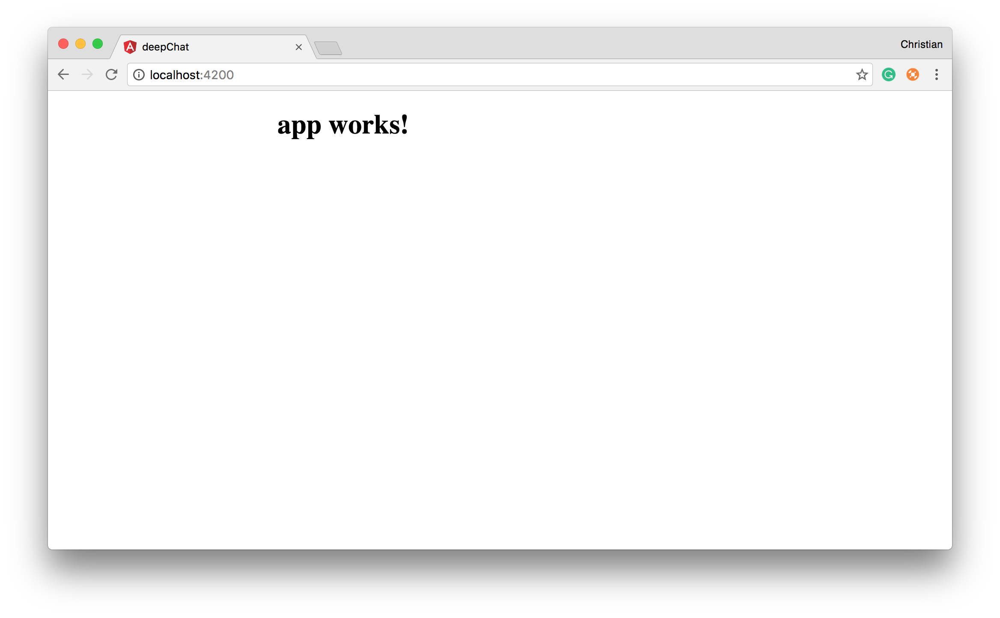

The "new Angular" popularly known as "Angular 2", [though a bad name] (https://toddmotto.com/please-stop-worrying-about-angular-3#real-versioning), is component architected. It follows the W3C component standards, thereby forcing us (for a good reason) to build apps as re-usable UI components/widgets. This means that you can't continue to build apps the same way you did while using version 1.x. You can get started with using the [Quickstart guide] (https://angular.io/docs/ts/latest/quickstart.html). 

[deepstreamIO](https://deepstream.io/) is a free real-time open source server that is fast, scales and makes working with real-time data easy. Deepstream is a good choice because it gives you the freedom to install a server on your machine or hosted server.

This article walks you through building a chat application, using the most popular front-end framework; Angular, alongside with [deepstreamIO](https://deepstream.io/) to take care of the chat's real-time feature.

## 1. Setup Angular
Angular provides a [CLI tool] (https://github.com/angular/angular-cli), which takes the pain of booting and scaffolding a project by reducing the process to just one command. The CLI can be installed via `npm`:

```bash
# Installs the Angular CLI tool
npm install -g angular-cli
```

The global installation adds the tool to your PATH so from anywhere, you can run:

```bash
# Creates a new Angular project
ng new deepchat
```

The `new` command scaffolds a new project. Once that is done, you can launch the new project, using:

```bash
# first, move a step into
# the project directory
# if you are not there yet
cd deepchat
# Launch app
ng serve
```



## 2. Install deepstream
One needs to install deepstream server the client as well. To install deepstream server: 

1. Download deepstream from the [deepstream install page](https://deepstream.io/install/) for your OS.
2. Unzip the downloaded content to your working directory or project folder
3. Start the server by opening a command window in the unzipped folder and running the following command:

```bash
./deepstream
```

Installing deepstream in Angular projects is quite simple. The framework bundles up scripts using Webpack, and splits these bundles in a manner that makes it easier for browsers to load them faster. To help with this process, rather than just installing the scripts anywhere, we install with `npm` and load the script as a vendor file.

First, install via `npm`:

```bash
npm install --save deepstream.io-client-js
```

Specify that the installed dependency is a vendor file, and should be loaded accordingly, by adding deepstream script to the `scripts` array in `./angular-cli.json`:

```json
. . .
"scripts": [
   "../node_modules/deepstream.io-client-js/dist/deepstream.js"
 ],
. . .
```

You can see that installation was successful by logging deepstream in your `AppComponent`'s constructor and inspecting the output in the browser:

```js
export class AppComponent {
    constructor() {
        // Logs the deepstream function
        console.log(deepstream);
    }
}
```

Depending on your Typescript configuration, calling `deepstream` from nowhere might throw an error. You can shut Typescript up by creating a type for deepstream, just after the imports:

```js
import { Component, OnInit } from '@angular/core';
// Type deepstream with any
declare var deepstream: any;
```

## 3. Create deepstream Service (DsService)
Deepstream works fine when used directly in the component. However, as your project grows large, you might find yourself in the deep mess of violating [DRY](https://en.wikipedia.org/wiki/Don't_repeat_yourself). A familiar pattern in Angular (both 1.x and the newer versions), is to create a service that abstracts a group of tasks, so this services can be used by multiple components if need be.

In our case, we need a service to group our entire deepstream tasks, and expose methods to our components to interact with:

```js
// ./src/app/services/ds.service.ts
import { Injectable } from '@angular/core';
declare var deepstream:any;

@Injectable()
export class DsService {

    private ds;
    public dsInstance;

    constructor() {
       this.ds = this.dsInstance = deepstream('localhost:6020');
    }
}
```

The `dsInstance` is public (though we know the deal with privacy in JavaScript), so you can access all `deepstream`'s method from it. If you think this is all you need from such service; fine! However, you can also wrap the standard methods by creating more members of the service:

```js
// ./src/app/services/ds.service.ts
import { Injectable } from '@angular/core';
declare var deepstream: any;

@Injectable()
export class DsService {

    private ds;
    public dsInstance;

    constructor() {
      this.ds = this.dsInstance = deepstream('localhost:6020');
    }

    login (credentials?, loginHandler?) {
      // {username: 'chris', password:'password'}
      this.ds.login(credentials, loginHandler);
    }

    getRecord(name) {
      return this.ds.record.getRecord(name);
    }

    getList(name){
      return this.ds.record.getList(name);
    }
}
```

Those are the three methods we need to log in, create or get a record, and create or get a list.

## 4. Login to deepstream
Authenticating to deepstream server does not require credentials and for simple stuffs like a demo, you can go ahead and perform an anonymous authentication:

```js
// ./src/app/app.component.ts
import { Component, OnInit } from '@angular/core';
import { DsService } from './services/ds.service';

@Component({
  selector: 'app-root',
  templateUrl: './app.component.html',
  // ...
})
export class AppComponent implements OnInit{
  title = 'deepChat';
  username;

  constructor(
    private ds: DsService
  ) {}

  ngOnInit() {
    // Get username from
    // window prompt and use 'anonymous' for
    // null or invalid response
    const defaultUsername = 'anonymous';
    const username = window.prompt('Please enter your username', defaultUsername);
    
    this.username = username || defaultUsername
    // Login without credentials
    this.ds.login(null, this.loginHandler);
  }
        
  loginHandler(success, data) {
    console.log('logged in', success, data);
  }

}
```

The `ngOnInit` method is a lifecycle method that is called when the component is initialized. This means that when the component is ready, we try to authenticate deepstream with no credentials. The username as gotten from `prompt`, is just used to identify who is who.

## A Note on deepstream Records and Lists

Records are deepstream's building blocks and are responsible for data syncing. This means that a record can be created and watched for data changes and when there are changes, it notifies all connected clients. They can as well be likened to record in databases because they store a JSON entity.

```js
ds.getRecord('recordname').set(jsonPayload);
```

The above snippet creates a record named `recordname` if the record name does not exist.  It also returns the record if the record name exists. The `set` method is used to pass in a payload for the record to store.

Lists on the other hand, are used to treat a group of records like collections. When such is the case, the records can be easily sorted, paged, etc. Lists can be created with the `getList` method and updated with `addEntry`:

```js
ds.getList('chats').addEntry('recordname')
```

## 5. Chat Messaging

Let's create another method that will be called, when the user creates a chat message:

```js
// ./src/app/app.component.ts
import { Component, OnInit } from '@angular/core';
import { DsService } from './services/ds.service';

@Component({
  selector: 'app-root',
  templateUrl: './app.component.html',
  styleUrls: ['./app.component.css']
})
export class AppComponent implements OnInit{
  title = 'deepChat';
  username;
  text;
  chats;

  constructor(
    private ds: DsService
  ) {}

  // . . .

  addChat() {

    const recordName = 'chat/' + this.ds.dsInstance.getUid();

    const chatRecord = this.ds.getRecord(recordName);
    chatRecord.set({username: this.username, text: this.text});
    this.text = '';
    // Update the chats list
    this.chats.addEntry(recordName);
  }
}
```

The `addChat` method creates a [record](https://deepstream.io/tutorials/core/datasync-records/), sets a value to the record, clears the text property and updates the deepstream chat list with the record name. `this.chats` holds the chat list, which will be initialized in `ngOnInit` in the next section.

The markup for creating messages is simple:

```html
// ./src/app/app.component.html
<div class="compose">
  <input type="text" [(ngModel)]="text">
  <button (click)="addChat()">Send</button>
</div>
```

We perform a two-way binding to the input with the `text` property, as well as add a click event listener to the send button which calls `addChat` method.

## 6. Chat Listing
The `chats` property, for now, is undefined and is supposed to be a [deepstream list](https://deepstream.io/tutorials/core/datasync-lists/), which holds the collection of deepstream records. 

We can create this list when the component is ready, and subscribe to it as well, so as to print the `chats` as they come in:

```js
// ./src/app/app.component.ts
// ...

@Component(...)
export class AppComponent implements OnInit{
  title = 'deepChat';
  username;
  text;
  chats;
  chatArray = [];

  constructor(
    private ds: DsService
  ) {}

  ngOnInit() {
    // . . . 

    this.chats = this.ds.getList('chats');

    this.chats.on('entry-added', recordName => {
            
      this.ds.getRecord( recordName ).whenReady( record => {

        record.subscribe( (data) => {
          if(data.username && data.text) {
            // Update bindable property  
            this.chatArray.push(data);
          }
        }, true );

      });
    })
  }

  // . . .
}
```

What is going on is; we created a list that records can be added to, as seen in the `addChat` method and then listened to this list for data entry. Once the list is updated, we update the `chatArray` which is the property that we need to iterate on the UI, to display the chats as shown below:

```html
<!-- ./src/app/app.component.html -->
<div class="chats">
      <p *ngFor="let chat of chatArray"><strong>{{chat.username}}: </strong> {{chat.text}}</p>
    </div>
```


